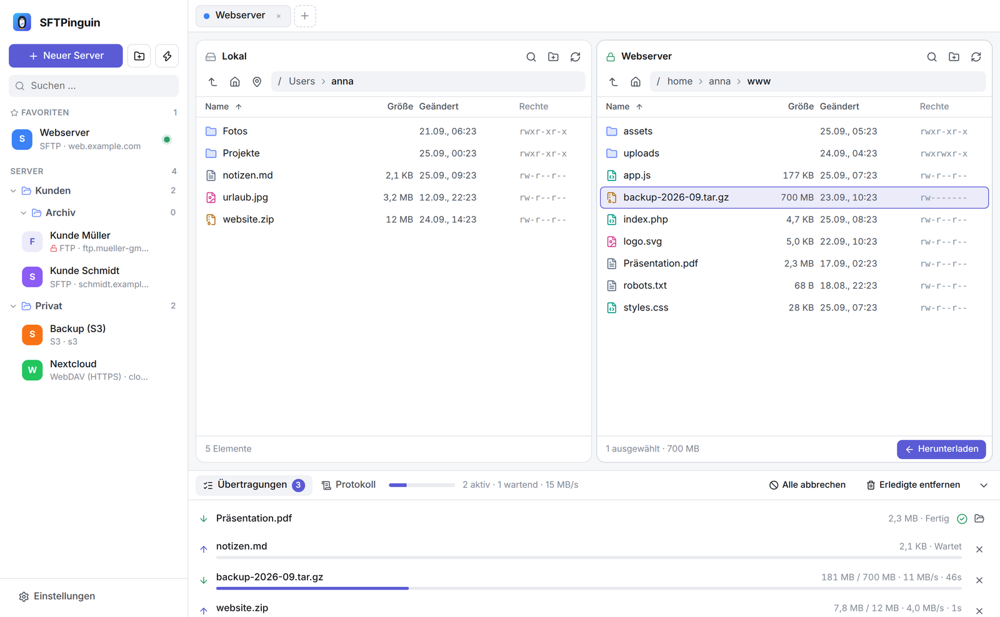
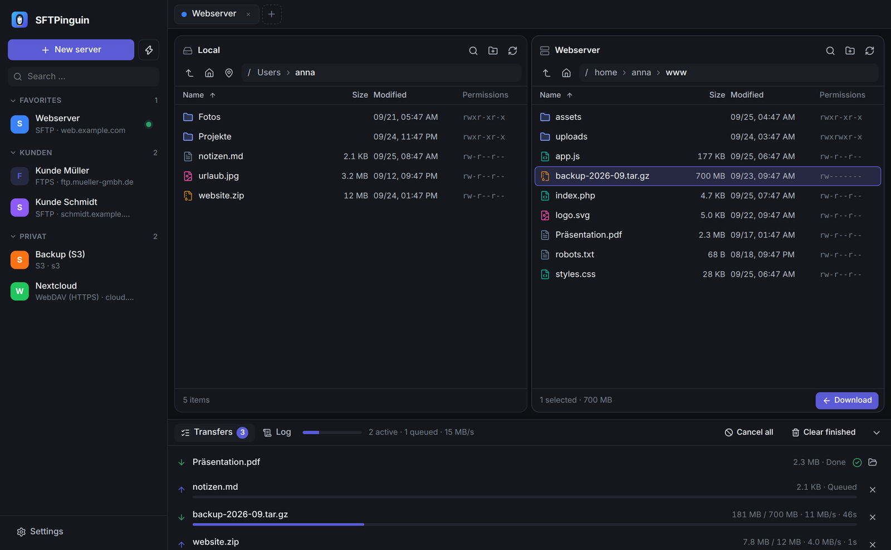
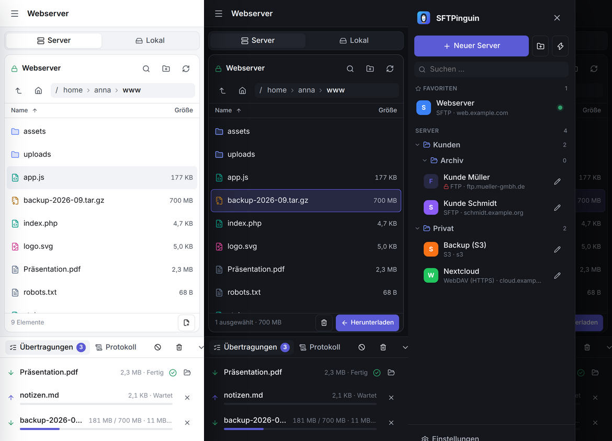

<p align="center">
  
</p>

<h1 align="center">SFTPinguin</h1>

<p align="center">
  Ein moderner, minimalistischer Dateitransfer-Client – wie FileZilla oder Cyberduck, nur aufgeräumt.<br/>
  <b>SFTP · FTP · FTPS · WebDAV · S3</b> – für Windows, macOS, Linux, Android und iOS.
</p>



## Funktionen

**Protokolle**

| Protokoll | Details |
|---|---|
| **SFTP** (SSH) | Passwort, Keyboard-Interactive, SSH-Schlüssel (Datei oder eingefügt, auch mit Passphrase), SSH-Agent (ssh-agent / Pageant). Host-Key-Prüfung mit Fingerabdruck und Warnung bei geändertem Schlüssel. |
| **FTP** | Passiver/aktiver Modus, MLSD und klassisches `LIST` (Unix/DOS), anonymer Login, UTF-8 – unverschlüsselt, daher nur nach Warnung |
| **FTPS** | Explizit (AUTH TLS) und implizit (Port 990), TLS-Session-Reuse (z. B. vsftpd), selbstsignierte Zertifikate per Zertifikat-Pinning |
| **WebDAV** | HTTP und HTTPS – z. B. Nextcloud, ownCloud, Synology, Apache, nginx |
| **S3** | Amazon S3 und kompatible Dienste (MinIO, Cloudflare R2, Wasabi, Backblaze B2, Hetzner …), Bucket-Übersicht, Path-Style |

**Server-Manager**
- Server speichern mit Name, Farbe, Favoriten, Notizen, Startverzeichnissen
- **Ordner** (beliebig verschachtelt): anlegen, umbenennen, löschen, Server per Drag & Drop oder „In Ordner verschieben“ einsortieren
- Passwörter sicher im Schlüsselbund des Betriebssystems (Windows Credential Manager, macOS Keychain, Secret Service/GNOME Keyring/KWallet); auf Handys im geschützten App-Speicher
- Schnellverbindung – auch mit URLs wie `sftp://user@host:2222/pfad`
- **Import aus FileZilla** (`sitemanager.xml` inkl. Ordnern und Passwörtern)

**Dateien & Übertragungen**
- Zwei Fenster (Lokal ↔ Server), mehrere Verbindungen gleichzeitig in Tabs
- Drag & Drop zwischen den Fenstern, in Unterordner, und Dateien direkt aus dem Explorer/Finder
- Übertragungswarteschlange mit Fortschritt, Geschwindigkeit, Restzeit, Abbrechen und Wiederholen
- Parallele Übertragungen (einstellbar), ganze Ordner rekursiv
- Bei vorhandenen Dateien: Überschreiben, Überspringen, nur neuere, beide behalten
- Änderungsdatum bleibt erhalten, Downloads laufen über `.part`-Dateien
- Remote-Dateien **direkt bearbeiten**: Datei öffnet sich im Standardprogramm, Änderungen werden erkannt und auf Wunsch hochgeladen
- Umbenennen, Löschen, neue Ordner/Dateien, Rechte ändern (chmod, auch rekursiv), Pfad kopieren, Filter, Sortierung, versteckte Dateien
- Zurück/Vor wie im Browser: **Maustasten 4/5 (Daumentasten)**, Alt+←/→ (macOS: Cmd+[ / Cmd+]) oder Pfeil-Knöpfe – für jedes Fenster getrennt
- Tastatur: Pfeiltasten, Enter, Backspace, Entf, F2, F5, Strg+A, Strg+F, Strg+T/W/Tab, Strg+, und Tipp-Suche
- Automatisches Wiederverbinden nach Verbindungsabbruch, Protokoll-Ansicht

**Oberfläche**
- Hell/Dunkel (oder automatisch), sechs Akzentfarben
- Deutsch und Englisch (automatisch nach Systemsprache)
- Responsives Handy-Layout mit Umschalter Server/Lokal und Seitenmenü

| Dunkel | Handy |
|---|---|
|  |  |

## Sicherheit

SFTPinguin ist so gebaut, dass im lokalen Netzwerk (WLAN, Firmen- oder Hotelnetz) niemand
Zugangsdaten oder Dateien mitlesen oder sich unbemerkt dazwischenschalten kann (Man-in-the-Middle):

- **Serveridentität wird vor der Anmeldung geprüft.** Passwörter und Schlüssel werden erst gesendet,
  wenn der SSH-Host-Key bzw. das TLS-Zertifikat verifiziert ist.
- **SSH:** Unbekannte Server werden mit SHA-256-Fingerabdruck angezeigt (Einträge aus `~/.ssh/known_hosts`
  werden automatisch erkannt). Ändert sich ein Schlüssel, bricht die Verbindung mit einer deutlichen
  Warnung ab; übernehmen lässt er sich nur nach ausdrücklicher Bestätigung. Nur moderne Verfahren:
  Curve25519/ML-KEM-Schlüsseltausch, AES-GCM/ChaCha20, SHA-2-MACs, „Strict KEX“ gegen die
  Terrapin-Attacke; `ssh-rsa`-Signaturen mit SHA-1 sind abgeschaltet.
- **TLS (FTPS, WebDAV, S3):** Zertifikate werden gegen die Mozilla-Stammzertifikate geprüft, nur TLS 1.2/1.3.
  Selbstsignierte Zertifikate (typisch bei NAS/Router) werden **nie blind akzeptiert**: Die App zeigt
  Aussteller, Gültigkeit und SHA-256-Fingerabdruck und merkt sich nach Bestätigung genau dieses
  Zertifikat (Pinning). Ein anderes Zertifikat löst eine MITM-Warnung aus. Auch die FTPS-Datenkanäle
  werden verschlüsselt und geprüft.
- **Klartext-Protokolle** (FTP, WebDAV/S3 über HTTP) sind rot gekennzeichnet und werden erst nach einer
  Warnung verbunden – oder in den Einstellungen komplett gesperrt. Die Schnellverbindung versucht bei
  `ftp://` automatisch zuerst verschlüsseltes FTPS. Verbindungen zum eigenen Rechner (`localhost`)
  sind ausgenommen, da sie das Netzwerk nie verlassen.
- **WebDAV** folgt keinen Umleitungen zu anderen Servern oder von HTTPS auf HTTP.
- Passwörter liegen im Schlüsselbund des Betriebssystems; Konfigurationsdateien und zum Bearbeiten
  geöffnete Dateien sind nur für den eigenen Benutzer lesbar.

> Hinweis: S3-Endpunkte mit selbstsigniertem Zertifikat werden aus Sicherheitsgründen nicht unterstützt
> (die verwendete S3-Bibliothek erlaubt kein Pinning). Nutze dafür ein gültiges Zertifikat (z. B. Let's Encrypt).

## Technik

- **[Tauri 2](https://tauri.app)** + **Rust** im Backend, **React + TypeScript** (Vite) im Frontend
- SFTP: [`russh`](https://crates.io/crates/russh) + [`russh-sftp`](https://crates.io/crates/russh-sftp) (reines Rust)
- FTP/FTPS: [`suppaftp`](https://crates.io/crates/suppaftp) mit rustls
- WebDAV: eigene Implementierung auf Basis von `reqwest`
- S3: [`rust-s3`](https://crates.io/crates/rust-s3)
- Kryptografie durchgehend über `ring`/rustls – keine OpenSSL-Abhängigkeit, dadurch einfache Builds für alle Plattformen inkl. Android/iOS

```
src/                 React-Oberfläche
  components/        Seitenleiste, Dateifenster, Server-Editor, Übertragungen, …
  lib/               API, Zustand (zustand), Übersetzungen, Aktionen
src-tauri/src/
  remote/            Protokolle (sftp.rs, ftp.rs, webdav.rs, s3.rs) hinter einem gemeinsamen Trait
  session.rs         Verbindungen inkl. Pool für parallele Übertragungen
  transfer.rs        Übertragungswarteschlange
  sites.rs           Server-Manager & FileZilla-Import
  secrets.rs         Passwortspeicher (Schlüsselbund / App-Sandbox)
  known_hosts.rs     Vertrauenswürdige SSH-Host-Keys
```

## Entwicklung

Voraussetzungen: [Node.js 20+](https://nodejs.org), [Rust](https://rustup.rs) und die
[Tauri-Systemvoraussetzungen](https://tauri.app/start/prerequisites/) für dein Betriebssystem.

```sh
npm install
npm run tauri dev        # App im Entwicklungsmodus starten
npm run tauri build      # Installer für das aktuelle System bauen
```

### Android

Benötigt Android Studio / SDK, NDK und Java 17 ([Anleitung](https://tauri.app/start/prerequisites/#android)).

```sh
rustup target add aarch64-linux-android armv7-linux-androideabi i686-linux-android x86_64-linux-android
npm run tauri android init
npm run tauri android dev        # auf Emulator oder Gerät
npm run tauri android build      # APK / AAB
```

### iOS

Nur auf macOS mit Xcode ([Anleitung](https://tauri.app/start/prerequisites/#ios)).

```sh
rustup target add aarch64-apple-ios x86_64-apple-ios aarch64-apple-ios-sim
npm run tauri ios init
npm run tauri ios dev
npm run tauri ios build          # benötigt ein Apple-Developer-Team zum Signieren
```

> Hinweis zu Handys: Die App arbeitet dort mit ihrem eigenen Dokumente-Ordner als lokale Seite.
> SSH-Agent-Anmeldung gibt es nur auf dem Desktop.

### Tests

```sh
cd src-tauri
cargo test                                   # Unit-Tests
```

Integrationstests gegen echte Server (SFTP, FTP, FTPS, WebDAV, WebDAV über HTTPS, S3) laufen mit lokalen
Testservern (Linux, als root):

```sh
sudo scripts/test-servers.sh
SFTPINGUIN_IT=1 SFTPINGUIN_IT_KEYS=/tmp/sftpinguin-test/ssh \
  cargo test --manifest-path src-tauri/Cargo.toml -- --include-ignored --test-threads=1
```

### Releases

Der Workflow `.github/workflows/release.yml` baut beim Pushen eines Tags (`v0.1.0`) Installer für
Windows (`.msi`/`.exe`), macOS (Apple Silicon & Intel, `.dmg`), Linux (`.deb`, `.rpm`, `.AppImage`)
sowie eine Android-APK und legt einen Release-Entwurf an.
